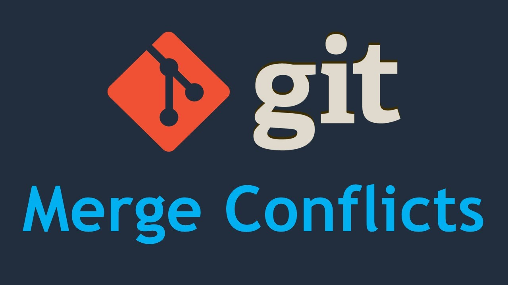

<!-- PROJECT LOGO -->
 

  
  <h2 align="center">Git Conflict</h2>
  

    Menjelaskan tentang Conflict di repository menurut pendaopat saya
  

# Apa saja yang menyebabkan terjadinya conflict?

Penyebab terjadinya conflict ialah ketika melakukan merge dengan kondisi terdapat perubahan di file yang sama dan baris yang sama. Saat melakukan merge dari 2 branch yang berbeda maka dapat menimbulkan conflict jika terdapat perubahan di file yang sama dan baris yang sama.

# Bagaimana menghindari conflict?

Cara menghindari conflict adalah dengan saling berkomunikasi dalam melakukan perubahan file agar tidak melakukan perubahan file dan baris yang sama dalam satu waktu yang bersamaan.

# Apa yang harus dilakukan apabila terjadi conflict?

Jika terjadi conflict saat merge dari branch maka solusi nya adalah memilih salah satu mana perubahan yang diinginkan dan yang tidak diinginkan bisa di hapus saja perubahan pada baris serta conflict yang muncul. 
